# Next.js MDX Portfolio - Architecture Documentation

This document provides a comprehensive analysis of the Next.js MDX Portfolio
codebase from both software architecture and developer perspectives. It includes
detailed breakdowns of the project structure, data flow, component architecture,
and technical implementation details.

## Table of Contents

- [Project Overview](#project-overview)
- [Architecture](#architecture)
  - [System Architecture](#system-architecture)
  - [Data Flow](#data-flow)
  - [Directory Structure](#directory-structure)
- [Key Components](#key-components)
  - [Page Components](#page-components)
  - [UI Components](#ui-components)
  - [Layout Components](#layout-components)
- [Content Management](#content-management)
  - [MDX Implementation](#mdx-implementation)
  - [File-based Routing](#file-based-routing)
- [State Management](#state-management)
- [API Integration](#api-integration)
- [Styling System](#styling-system)
- [Performance Optimization](#performance-optimization)
- [Development Workflow](#development-workflow)
- [Extension Points](#extension-points)

## Project Overview

This portfolio website is built with Next.js and uses MDX for content
management. It showcases blog posts and projects in a clean, responsive design
with modern UI/UX features including:

- Light/dark mode theming
- MDX content rendering with syntax highlighting
- Responsive design with mobile navigation
- Form handling for contact and newsletter subscriptions
- Email integration via Resend API

The site is structured around several key sections:

- Homepage with introduction and featured content
- Blog posts section
- Projects showcase
- Contact form

## Architecture

### System Architecture

The project follows a modern React application architecture built on Next.js 14
App Router. Here's a high-level overview of the system architecture:

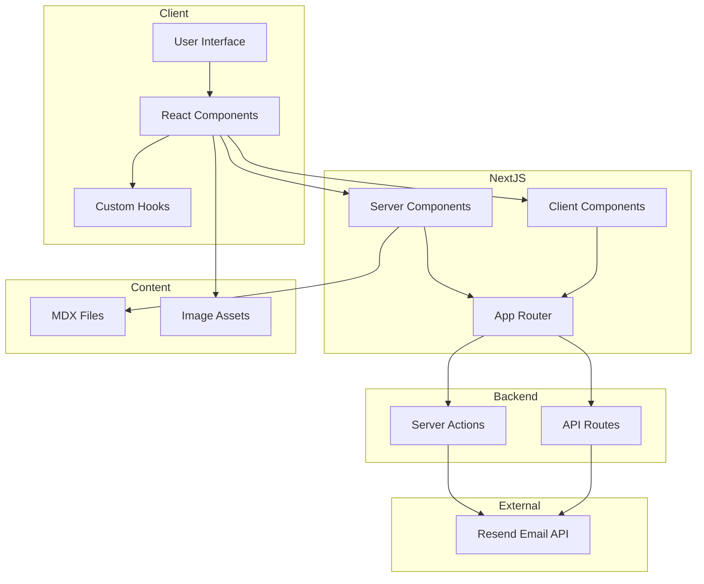

### Data Flow

The application employs a straightforward data flow pattern:

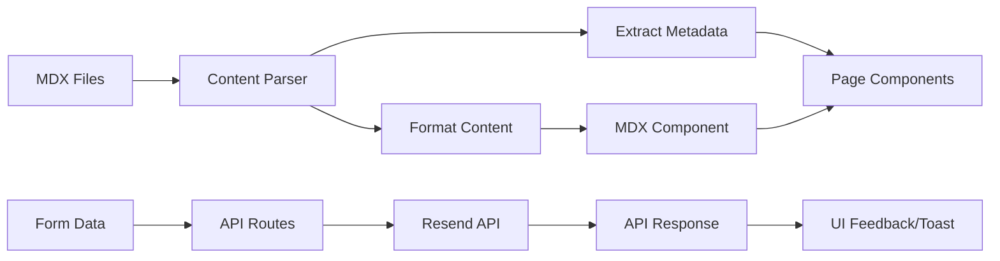

### Directory Structure

The project follows a clear and organized directory structure:

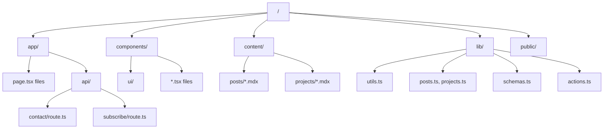

## Key Components

### Page Components

The application uses Next.js App Router for file-based routing with the
following key pages:

1. **Homepage (`app/page.tsx`)**: Entry point featuring intro, recent posts, and
   projects
2. **Posts Page (`app/posts/page.tsx`)**: Lists all blog posts with search
   functionality
3. **Post Detail (`app/posts/[slug]/page.tsx`)**: Displays individual post
   content
4. **Projects Page (`app/projects/page.tsx`)**: Lists all projects
5. **Project Detail (`app/projects/[slug]/page.tsx`)**: Displays individual
   project content
6. **Contact Page (`app/contact/page.tsx`)**: Contact form for user
   communication

### UI Components

The UI layer consists of several reusable components:

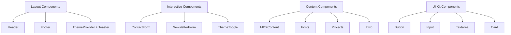

#### Component Interaction Flow

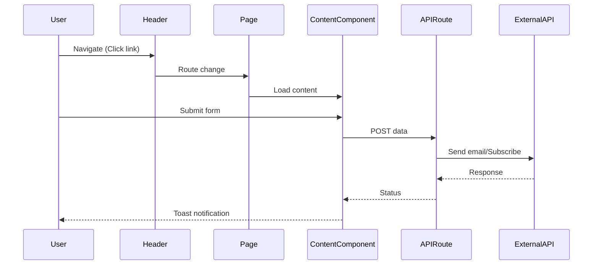

### Layout Components

The application uses a consistent layout structure across pages:

1. **RootLayout (`app/layout.tsx`)**: Top-level layout with font loading,
   metadata, and theme providers
2. **Header (`components/header.tsx`)**: Navigation with responsive mobile menu
3. **Footer (`components/footer.tsx`)**: Social links and copyright information

## Content Management

### MDX Implementation

The portfolio uses a file-based content management approach with MDX:

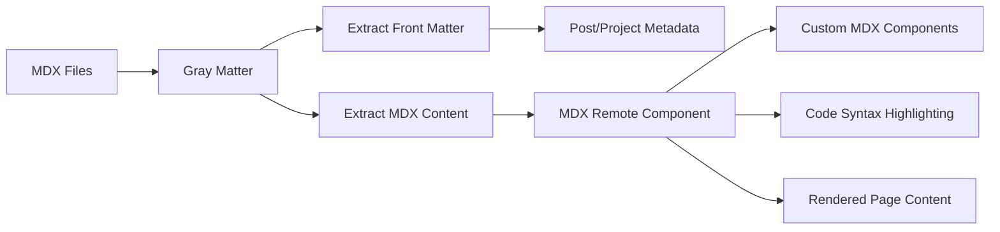

The MDX implementation includes:

- Frontmatter extraction using gray-matter
- Custom components including syntax highlighting
- Next Image optimization for embedded images
- Custom MDX components like Counter

### File-based Routing

The application leverages Next.js App Router for file-based routing:

- Static routes for main pages
- Dynamic routes with `[slug]` for individual posts and projects
- API routes for form handling

## State Management

The application uses React's built-in state management with:

1. **Local Component State**: useState for component-specific state
2. **ThemeContext**: Provided by next-themes for light/dark mode
3. **Form State**: Managed by react-hook-form with zod validation

## API Integration

The application integrates with external services:

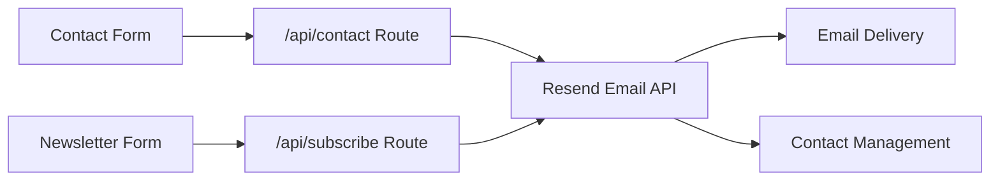

## Styling System

The project uses a modern styling approach:

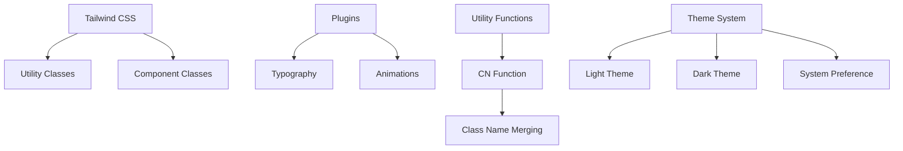

Key styling features include:

1. **Tailwind CSS**: For utility-based styling
2. **CSS Variables**: For theme customization
3. **Responsive Design**: Mobile-first approach with breakpoints
4. **Dark Mode**: Full dark mode support via next-themes
5. **Animation**: Smooth transitions and hover effects

## Performance Optimization

The project implements several performance optimizations:

1. **Static Site Generation**: Pre-rendering content at build time
2. **Image Optimization**: Using Next.js Image component
3. **Code Splitting**: Automatic code splitting by Next.js
4. **Dynamic Imports**: For lazy-loading components when needed

## Development Workflow

The development workflow is structured around typical Next.js conventions:

1. **Local Development**: Using `npm run dev`
2. **Building**: Creating production builds with `npm run build`
3. **Linting**: Code quality checks via `npm run lint`
4. **Deployment**: Optimized for deployment on Vercel

## Extension Points

The application is designed with several extension points:

1. **Adding Content**: Simply add new MDX files to content/posts or
   content/projects
2. **Custom MDX Components**: Extend MDX functionality in mdx-content.tsx
3. **UI Components**: Add or modify components in the ui/ directory
4. **API Routes**: Add new API endpoints in the app/api/ directory
5. **Styling**: Customize theming in globals.css and tailwind.config.ts

## Technical Implementation Details

### Email Integration

The application uses the Resend API for email functionality:

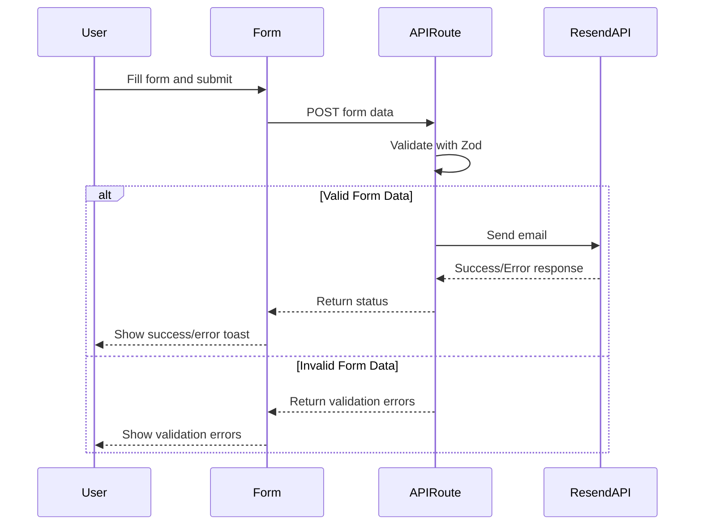

### Theming System

The theme implementation uses next-themes:

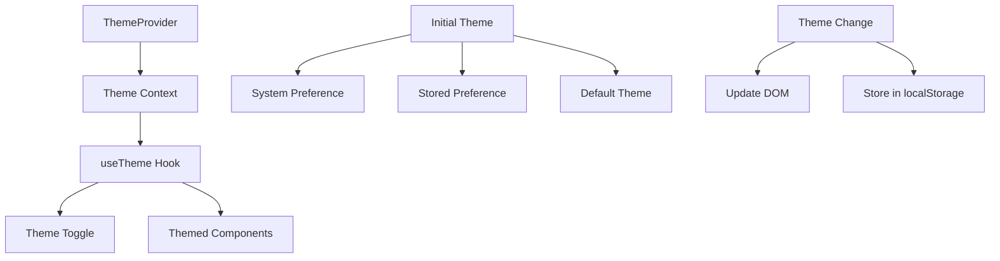

### Search Implementation

The portfolio includes a simple yet effective search function for posts:

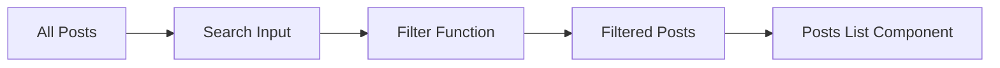

## Conclusion

The Next.js MDX Portfolio is a well-structured, modern web application that
effectively combines the power of Next.js framework with MDX content management.
The architecture follows clean programming principles with modular components,
clear separation of concerns, and efficient data flow patterns. The styling
system provides a consistent design language throughout the application while
ensuring responsiveness across different device sizes.

The project demonstrates effective use of modern web development practices
including server components, static site generation, theme customization, and
responsive design. It provides a solid foundation that can be easily extended
for additional features or content types.
